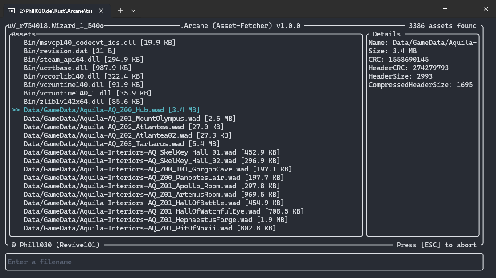

    
    <h1>Arcane  
    
    
    
    
    </h1>

- [Getting Started](#getting-started)
- [Features](#features)
- [Usage](#usage)
- [Contributing](#contributing)
- [Legal Notice](#legal-notice)
- [License](#license)

---

# Screenshots

# Getting Started
Arcane is a terminal-based application for fetching and managing Wizard101 assets. It provides an intuitive interface for navigating, selecting, and fetching assets using a fuzzy search functionality.

# Features
- **Terminal Interface**: User-friendly terminal interface using `ratatui`.
- **Fuzzy Search**: Search for assets with fuzzy matching via the `fuzzywuzzy` library.
- **Asset Management**: Fetch and manage assets with visual indicators.
- **Extended Information**: Toggle detailed information for selected assets.
- **Fetching Assets**: Every asset from the game can be downloaded by this tool.

> [!WARNING]  
> Known issue: Searching may be slow due to [Levenshteins Distance](https://en.wikipedia.org/wiki/Levenshtein_distance) being calculated for every one of the 3000+ assets! (Contributions are welcome!)

# Usage
Double click the executable to start the application. As soon as you see a list of files, you can either navigate using `[⬆]` or `[⬇]` or by simply writing the name of the file you are searching for. To toggle extended file info, simply press `[SPACE]`. You can exit the application by pressing `[ESC]`.

# Contributing
Contribution guidelines can be found [here](./CONTRIBUTING.md).

# Legal Notice
> [!IMPORTANT]
> Please be advised that all assets related to Wizard101 are the exclusive property of KingsIsle Entertainment, Inc. These assets are protected by intellectual property laws and regulations. Unauthorized distribution, reproduction, or any other form of dissemination of these assets is strictly prohibited and may result in legal action. Use of Wizard101 assets must comply with KingsIsle Entertainment's terms of service and any other applicable legal requirements.

# License

<a property="dct:title" rel="cc:attributionURL" href="https://github.com/Revive101/Arcane">Arcane</a> by <a rel="cc:attributionURL dct:creator" property="cc:attributionName" href="https://github.com/Phill030/">Phill030</a> is licensed under <a href="http://creativecommons.org/licenses/by-nc-sa/4.0/?ref=chooser-v1" target="_blank" rel="license noopener noreferrer" style="display:inline-block;">CC BY-NC-SA 4.0</a>

© Phill030 (Revive101)
